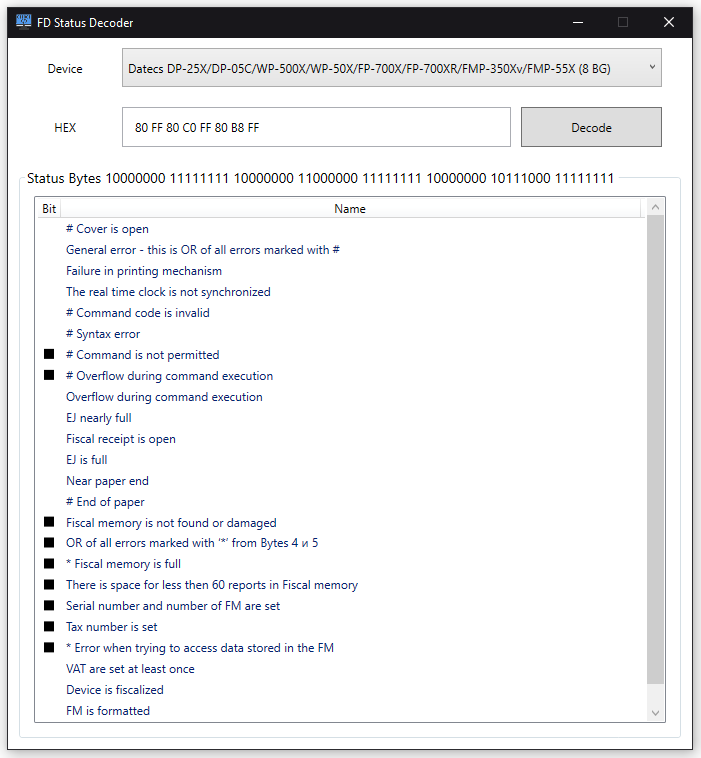

<!-- ABOUT THE PROJECT -->
## About The Project
<a name="readme-top"></a>


This application will help you decode the response from the fiscal device.

How:
* It accepts numbers in HEX format as input.<br /> 
Removes all invalid characters. Removes numbers less than **127**.<br />
For example: *04H 80H 80H C0H 80H 80H B8H 05H* > *80 80 C0 80 80 B8*.
* Converts to bytes *80 80 C0 80 80 B8 FF FF* > *10000000 10000000 11000000 10000000 10000000 10111000*.
* Parse on existing <a href="#add-documentation">documentation</a>.

Of course, you will have to make changes to the program if you are interested in other groups of <a href="#add-target-devices-to-application-process">fiscal devices</a> or other <a href="#add-manufacturer">manufacturers</a>.

<!-- GETTING STARTED -->
## Getting Started

Something you might want to change before using the product.

### Add manufacturer


Create new Manufacturer in Domain/Manufacturer.
  ```csharp
  public sealed class *YourManufacturer* : BaseManufacturer
  {
      ...
  }
  ```

### Add documentation

Add new line in property **AllModels**. Find at Domain/Manufacturer/*YourManufacturer*.cs
  ```csharp
    public override Dictionary<(string[], Country), Dictionary<(int, int), string>>? AllModels => new()
    {
        {(new string[] { "DP-05", "DP-25", "DP-35", "WP-50", "DP-150" }, Country.BG), Document1! },
        {(new string[] { "YourModel1", "YourModel2", "YourModel3" }, Country.YourCountry), YourDocument! },
        ...
    };
  ```
  P.S. Example for document you can find in *BaseManufacturer.cs* <br /> 
  P.P.S. Usually in documantation from manufacturer FD first Bit from left have name 0.7, but im my program we call it 0.0
  
### Add target devices to application process

Add new line in method **InitializeDevices**. Find at Application/MainViewModel.cs
  ```csharp
    private static List<IDeviceModels> InitializeDevices() => new List<IDeviceModels>()
        {
            new DeviceModels(Datecs.Instance, 6 , Country.BG , new string[] { "DP-05", "DP-25", "DP-35", "WP-50", "DP-150" }),
            new DeviceModels(YourManufacturer.Instance, 6, Country.YourCountry, new string[] { "YourModel1" }),
            ...
        };
  ```
